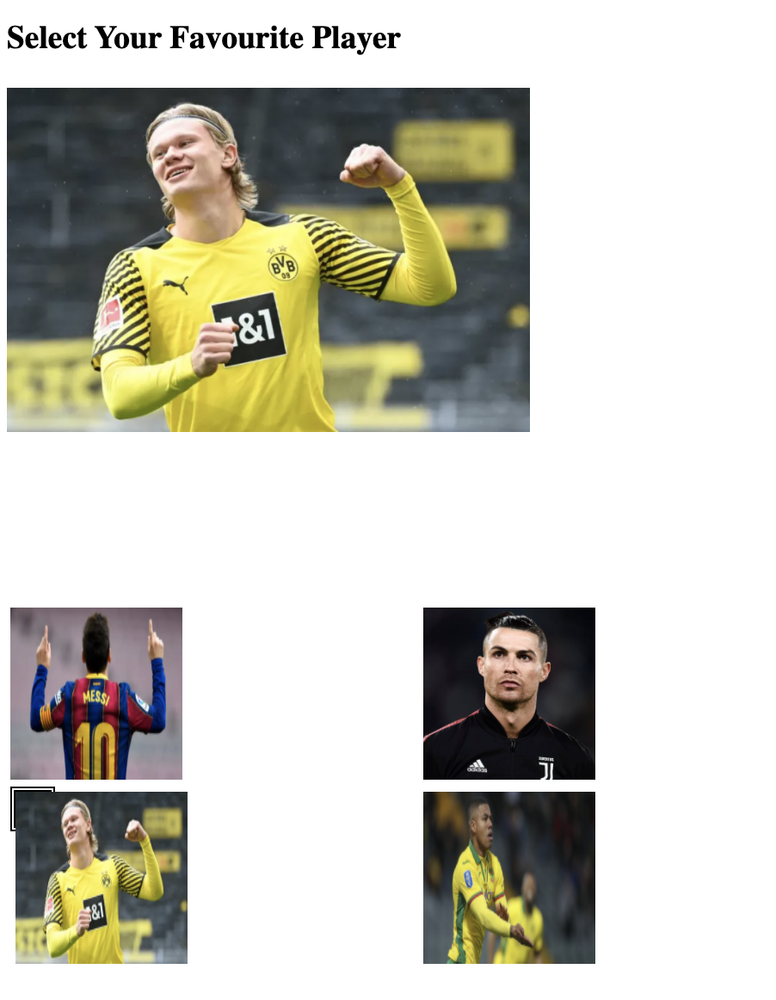

# ReactPlayerSelection
Select your favourite football player and see details built using React, ReactHooks, Redux and Thunk (Middleware)

How to run In the project directory, run:

yarn install yarn start

Runs the app in the development mode. Open http://localhost:3000 to view it in the browser.

Technologies Used:

React (Functional Components)
Redux (State managment Store)
Middleware (Redux Thunk)
Material UI (For Grid Container)
Axios (For API Call)
Color Widget App:

Fetches List of Player Details From the API - Static Data currently
User can select the player and can see the selected player in the main box.
Errors Handling are done in Place

